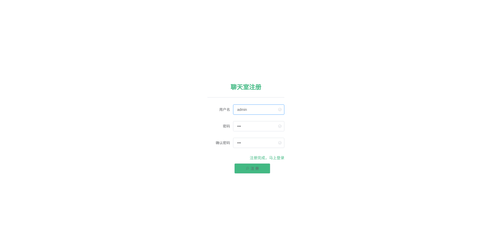

# gin-vue-chat
小学期-实时通讯系统的设计与实现
### [后端部分](https://github.com/Peterliang233/go-chat)
+ 后端部分使用的是Go语言的 [Gin框架](https://gin-gonic.com/) 。使用了Jwt做了中间的身份认证。同时使用Websocket实现了基本的通信。最后使用的是mysql进行数据的持久化。

+ 数据库架构
  

#### 主要接口
+ 新用户的注册
+ 用户登录
+ 用户之间进行Websocket通信
+ 文件上传
+ 文件下载

### [前端部分](https://github.com/Peterliang233/vue-chat)

+ 前端部分使用的是 [Vue框架](https://cn.vuejs.org/v2/guide/) 写了几个简单的交互界面。组件使用的是Element-UI。完成了与后端的交互。

### 效果展示

+ 用户注册

+ 用户登录

+ 进入房间

+ 多人在线聊天

+ 上传文件

